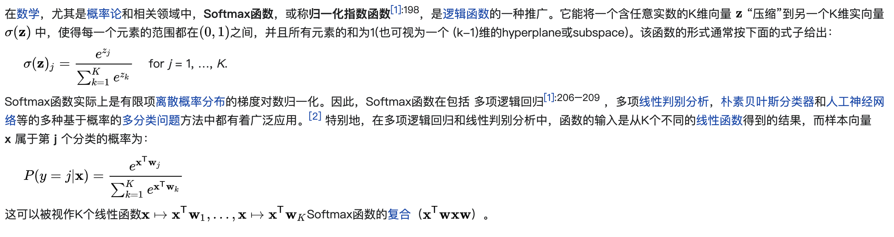

### 似然函数

似然函数（英语：likelihood function）是一种关于统计模型中的参数的函数，表示模型参数中的似然性（英语：likelihood）。似然函数在统计推断中有重大作用，如在最大似然估计和费雪信息之中的应用等等。文字意义上，“似然性”与“或然性”或“概率”意思相近，都是指某种事件发生的可能性，但是在统计学中，“似然性”和“概率”（或然性）有明确的区分：概率，用于在已知一些参数的情况下，预测接下来在观测上所得到的结果；似然性，则是用于在已知某些观测所得到的结果时，对有关事物之性质的参数进行估值，也就是说已观察到某事件后，对相关参数进行猜测。

https://zh.wikipedia.org/wiki/%E4%BC%BC%E7%84%B6%E5%87%BD%E6%95%B0

### 概率密度函数

基本定义如下

### 概率质量函数

概率质量函数是离散随机变量在各特定取值上的概率。概率质量函数和概率密度函数不同之处在于：概率质量函数是对离散随机变量定义的，本身代表该值的概率；概率密度函数是对连续随机变量定义的，本身不是概率，只有对连续随机变量的概率密度函数在某区间内进行积分后才是概率。

### Softmax

基本定义如下

### Argmax