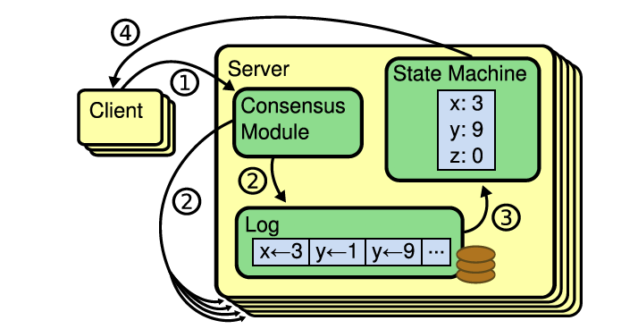

### RAFT 算法

RAFT是一个一致性算法，那么一致性算法是什么呢？

```
Consensus algorithms allow a collection of machines to work as a coherent group that can survive the failures of some of its members. Because of this, they play a key role in building reliable large-scale software systems.
```

RAFT 算法可以看做三两部分组成:

1. Leader Election
2. Log Replication
3. Safety

RAFT 算法有以下特点

1. Strong leader log entries 只由leader 发送到其他servers。
2. Leader election 即不指定leader，leader是通过一定的选举算法选举产生
3. Membership changes 在集群配置变更（例如，成员变更）的时候，允许集群正常服务（joint consensus）

为何有了Paxos，还会有raft

1. Paxos 晦涩难懂
2. 

#### 复制状态机（replicated state machines)

一致性算法一般是在复制状态机的基础上发展而来的。复制状态机结构图如下，通常用复制日志的形式来实现。

1. 每一个节点保存了一个包含一系列命令的日志。这些命令是该节点的状态机执行记录。
2. 每一个节点的日志保存了同样的命令（命令的顺序也是相同的），即每一个节点的状态机执行了相同的命令序列。
3. 因为每一个节点的状态机都是确定的（即确定状态机），所以，相同序列的命令执行过后，保证了最终的状态机和输出相同。



应用于实际系统的一致性算法一般有以下特征:

1. 安全性，即从来不会返回错误的结果。
2. 高可用性，只要集群中的大部分机器能运行，可以互相通信并且可以和客户端通信，这个集群就可用。
3. 不依赖时序保证一致性，时钟错误和极端情况下的消息延迟在最坏的情况下才会引起可用性问题。
4. 通常情况下，一条命令能够尽可能快的在大多数节点做出响应时完成，一部分慢的机器不会影响系统的整体性能。

#### CAP

CAP定理（CAP theorem，此处的A和ACID中的A不是同一个词），指出对于一個分布式计算系统而言，不可能同時满足以下三点：

1. 一致性（Consistency） （等同于所有节点访问同一份最新的数据副本）
2. 可用性（Availability）（每次请求都能获取到非错的响应——但是不保证获取的数据为最新数据）
3. 分区容错性（Partition tolerance）（以实际效果而言，分区相当于对通信的时限要求。系统如果不能在时限内达成数据一致性，就意味着发生了分区的情况，必须就当前操作在C和A之间做出选择。

理解CAP理论的最简单方式是想象两个节点分处分区两侧。允许至少一个节点更新状态会导致数据不一致，即丧失了C性质。如果为了保证数据一致性，将分区一侧的节点设置为不可用，那么又丧失了A性质。除非两个节点可以互相通信，才能既保证C又保证A，这又会导致丧失P性质。

**RAFT协议放弃了A，保留了CP**


#### State

raft 协议会在各个节点上保存状态信息，状态信息根据节点role的不同，保存类型的不同会包括以下内容。

**Persistent state on all servers（持久化保存在所有节点上）**

|名称|描述|
|---|---|
|currentTerm|服务器最后知道的任期号（从 0 开始递增）|
|votedFor|在当前任期内收到选票的候选人 id（如果没有就为 null）|
|log[]|日志条目；每个条目包含状态机的要执行命令和从领导人处收到时的任期号|

**Volatile state on all servers**

|名称|描述|
|---|---|
|commitIndex|已知的被提交的最大日志条目的索引值（从 0 开始递增）|
|lastApplied|被状态机执行的最大日志条目的索引值（从 0 开始递增）|

**Volatile state on leaders**

|名称|描述|
|---|---|
|nextIndex[]|对于每一个节点，记录需要发给它的下一个日志条目的索引（初始化为领导人上一条日志的索引值 +1）|
|matchIndex[]|对于每一个节点，记录已经复制到该服务器的日志的最高索引值（从 0 开始递增）|

#### AppendEntries RPC

AppendEntries RPC 是Raft协议中，最基本的两个RPC调用之一。在Log Replication 过程中，由leader请求follower，用来复制log entries，同时也用于心跳。

**Arguments**

|名称|描述|
|---|---|
|term|领导人的任期号|
|leaderId|领导人的 id，为了其他服务器能重定向到客户端|
|prevLogIndex|最新日志之前的日志的索引值|
|prevLogTerm | 最新日志之前的日志的Term|
|entries[]| 将要存储的日志条目（表示 heartbeat 时为空，有时会为了效率发送超过一条）|
|leaderCommit|领导人提交的日志条目索引值|

**Results**

|名称|描述|
|---|---|
|term|当前的任期号，用于领导人更新自己的任期号|
|success|如果其它服务器包含能够匹配上 prevLogIndex 和 prevLogTerm 的日志时为真|

**接收者需要实现**

1. 如果 term < currentTerm返回 false
2. 如果在prevLogIndex处的日志的任期号与prevLogTerm不匹配时，返回 false
3. 如果一条已经存在的日志与新的冲突（index 相同但是任期号 term 不同），则删除已经存在的日志和它之后所有的日志
4. 添加任何在已有的日志中不存在的条目
5. 如果leaderCommit > commitIndex，将commitIndex设置为leaderCommit和最新日志条目索引号中较小的一个

#### RequestVote RPC

由candidates调用，用来获取足够的选票。

**Arguments**

|名称|描述|
|---|----|
|term | 候选人的任期号|
|candidateId|	请求投票的候选人 id |
|lastLogIndex| 候选人最新日志条目的索引值 |
|lastLogTerm| 候选人最新日志条目对应的任期号 |

**Results**

|名称|描述|
|---|----|
|term|	目前的任期号，用于候选人更新自己|
|voteGranted|	如果候选人收到选票为 true|

**接收者需要实现**

1. 如果term < currentTerm返回 false
2. 如果votedFor为空或者与candidateId相同，并且候选人的日志和自己的日志一样新，则给该候选人投票


#### 所有节点需要遵守的规则


**所有节点**

1. 如果commitIndex > lastApplied，lastApplied自增，将log[lastApplied]应用到状态机
2. 如果 RPC 的请求或者响应中包含一个 term T 大于 currentTerm，则currentTerm赋值为 T，并切换状态为追随者（Follower）

**Follower**

1. 响应来自候选人和领导人的 RPC
2. 如果在超过选取领导人时间之前没有收到来自当前领导人的AppendEntries RPC或者没有收到候选人的投票请求，则自己转换状态为候选人

**Candidates**

1. 转变为选举人之后开始选举：
 1. currentTerm自增
 1. 给自己投票
 1. 重置选举计时器
 1. 向其他服务器发送RequestVote RPC
1. 如果收到了来自大多数服务器的投票：成为领导人
1. 如果收到了来自新领导人的AppendEntries RPC（heartbeat）：转换状态为追随者
1. 如果选举超时：开始新一轮的选举

**Leader**

1. 一旦成为领导人：向其他所有服务器发送空的AppendEntries RPC（heartbeat）; 在空闲时间重复发送以防止选举超时
1. 如果收到来自客户端的请求：向本地日志增加条目，在该条目应用到状态机后，响应客户端
1. 对于Leader节点上保存的每一个Follower状态来说，如果上一次收到的日志索引大于将要收到的日志索引（nextIndex）：通过AppendEntries RPC将 nextIndex 之后的所有日志条目发送出去 
 1. 如果发送成功：将该追随者的 nextIndex和matchIndex更新
 1. 如果由于日志不一致导致AppendEntries RPC失败：nextIndex递减并且重新发送（5.3 节）
1. 如果存在一个满足N > commitIndex和matchIndex[i] >= N并且log[N].term == currentTerm的 N，则将commitIndex赋值为 N

#### raft 算法

**状态迁移**

raft 协议中，各个role的状态转移过程如下图所示。


**term**

raft 协议中，将时间划分为任意长度的terms。terms 用递增的整数表示。每一个term的开始阶段都是election，在leader选举正常结束后，就会进入正常操作阶段 。term可以看做是raft协议中的逻辑时钟。关于term需要注意

1. 如果一个Follower节点，接收的请求中的term < currentTerm，那么这个节点就应该拒绝这个request
2. 如果一个Candidate或者Leader，发现currentTerm < 请求中的term，那么应该立刻变为Follower状态


#### Leader Election
 
1. 所有节点在初始化时，都在Follower状态。
1. 在election timeout时间内，如果Follower状态没有感知到来自Leader的消息，那么进入Candidate状态，同时增加term 值。
 * 每一个节点的election timeout都是随机的，以避免所有节点都变为Candidate状态，出现split vote状态(一般为150ms~300ms中的某个随机值)。
 * 开始一次新的选举时，会重置一个随机的超时时间。
1. Candidate 会vote它自己，然后向其他节点请求votes（RequestVote RPC)
 * 如果收到半数以上的节点的选票（相同term），变为Leader。一个节点在一个相同的term下，最多只会选举一个Candidate。
 * 收到AppendEntries 请求，此时如果请求中的term >= currentTerm，那么就意味着另一个节点已经变成了Leader，该节点接收请求，同时变为Follower。如果term < currentTerm，那么拒绝该请求，并继续维持Candidate 状态。
 * 在超时之前，没有满足以上两个条件时，Candidate 会增加term，然后开始新一轮的选举。
1. Leader 会周期性的发送Append Entries，作为心跳, Followers 会回答Append Entries，并重置election timeout。
1. 7-8 两步会一直持续直到Follower停止接收心跳或者变为Candidate
1. 在leader宕机后，由于Follower在election timeout时间内收不到来自Leader的消息，会自动变为Candidate

在leader election完成之后，对etcd 集群的更改都将通过leader来完成。

#### Log Replication

1. 每一个更改作为一个entry，加入leader 节点的log
2. log entry 并不马上提交，会将log entry(也是心跳)的副本发送到其他follower 节点
 * leader会等待直到大多数节点收到entry
 * 如果超时时间内，没有收到大多数节点的返回结果，会无限重试。
4. leader节点会提交entry，改变待更改的值。
5. 返回请求给客户端，表示操作成功
5. 通知followers 提交entry。在下一个AppendEntries中确认。

#### Safety

#### FAQ

**1. etcd 中所有的客户端请求是否都会被送到Leader**

1. 所有需要一致性的请求，都会被Follower转发给leader
2. 不需要一致性的请求（serialized reads），可以被集群中的任意一个节点处理。

**2. 替换一个故障节点前，是否应该先加入一个新节点**

1. 应该先去除故障节点，然后加入新的节点。因为在已经有一个节点故障的情况下，加入一个新的节点，此时集群的FAILURE TOLERANCE的数量是没有变化的。例如此前，有3个节点，1个故障，再加入一个节点后，变成4个节点。此时每一个变更需要所有3个健康节点达成一致。和移除故障节点后的情况是类似的。同时，由于新加入的节点错误配置等的风险较大，所以一旦新加入的节点有问题，那么就会导致整个集群不可用。但是在移除之后，再加入的情况下，新的节点故障，并不会影响集群的正常运行。

#### go-raft


参考资料

> https://www.infoq.cn/article/raft-paper
> https://aphyr.com/posts/313-strong-consistency-models
> http://thesecretlivesofdata.com/raft/
